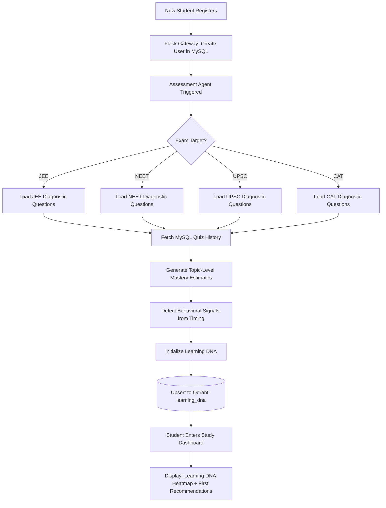
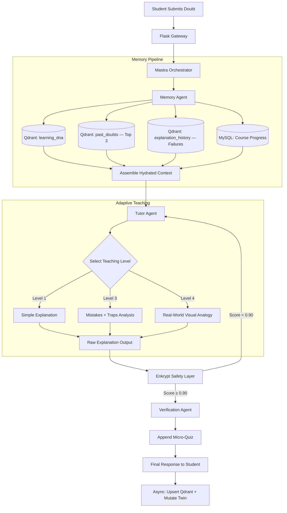

# Mentra X — Agent Workflows

**Purpose:** Detailed step-by-step workflows for all seven core interactions.

---

## Workflow 1: Student Onboarding



---

## Workflow 2: Adaptive Assessment

**Trigger:** New subject enrolled OR monthly calibration.

**Step-by-Step:**

| Step | Actor | Action |
|---|---|---|
| 1 | Assessment Agent | Load topic list for exam target |
| 2 | Assessment Agent | Start with `difficulty = 0.5` (medium) |
| 3 | Student | Answers first question |
| 4 | Assessment Agent | Evaluate response via Mastra tool `evaluate_answer` |
| 5a | Assessment Agent (if correct) | `difficulty += 0.1`, next topic same depth |
| 5b | Assessment Agent (if wrong) | `difficulty -= 0.1`, record `failure(topic)` |
| 6 | Assessment Agent | Repeat steps 3-5 for all key topics |
| 7 | Assessment Agent | Synthesize `knowledge_state` object |
| 8 | Assessment Agent | Upsert to Qdrant `learning_dna` |
| 9 | Insight Agent | Generate "Your Baseline Report" |

---

## Workflow 3: Doubt Solving

**Trigger:** Student types a doubt in the Cognitive Chat UI.



---

## Workflow 4: Memory Retrieval

**Trigger:** Called by Memory Agent at the start of every doubt session.

```
1. PARALLEL FETCH:
   ├── fetch_digital_twin(user_id)
   │     → Qdrant filter: collection=learning_dna, user_id=X
   │     → Returns: full twin JSON payload
   │
   ├── retrieve_past_doubts(embed(doubt_text), user_id)
   │     → Qdrant cosine search: collection=past_doubts, user_id=X
   │     → Top-3 by similarity
   │     → Returns: [{question_text, teaching_level_used, resolved}, ...]
   │
   ├── retrieve_failed_explanations(topic, user_id)
   │     → Qdrant filter: collection=explanation_history
   │       user_id=X, concept=topic, student_success_flag=False
   │     → Returns: [teaching_level: 2, analogy: "Carnot cycle example"], ...
   │
   └── fetch_mysql_context(user_id)
         → Course progress, current chapter, XP streak

2. ASSEMBLE:
   hydrated_context = {
     digital_twin: ...,
     similar_prior_doubts: [...],
     failed_approaches: [...],
     mysql_progress: {...}
   }

3. PASS to Tutor Agent as system prompt extension
```

---

## Workflow 5: Understanding Verification

**Trigger:** Tutor Agent output has passed Enkrypt validation.

```
1. Verification Agent receives:
   - explanation_text (Enkrypt-validated)
   - concepts_addressed: ["entropy", "second law"]
   - teaching_level_used: 3
   - twin.learning_style: "Visual"

2. Generate micro-quiz question:
   → "If the temperature of a heat reservoir increases,
      what happens to the entropy change of the universe?"
   (Calibrated to NOT be identical to the doubt — tests transfer of understanding)

3. Student answers

4. Evaluate answer:
   → Semantic similarity to correct answer
   → Confidence threshold: 0.75 = PASS

5a. IF PASS:
   → "Great! You understood the core concept."
   → Upsert: explanation_history (success_flag=True)
   → Mutate: learning_dna mastery_score[entropy] += 0.05

5b. IF FAIL:
   → "That's not quite right. Let me try a different angle."
   → Auto-trigger Tutor Agent at Level (current_level + 1)
   → Upsert: explanation_history (success_flag=False)
   → Mutate: learning_dna mistake_count[entropy] += 1
```

---

## Workflow 6: Weak Area Detection

**Trigger:** Mastra cron-workflow fires after every 5th completed session.

```
1. Fetch last 5 session_logs from Qdrant (filter: user_id=X, last 5)

2. Extract all failed_concepts from session payloads:
   ["entropy", "Clausius inequality", "Carnot efficiency",
    "entropy", "entropy", "heat engine efficiency"]

3. Cluster by semantic similarity:
   → Cluster 1: ["entropy", "Clausius inequality", "entropy"] → macro: "Second Law & Entropy"
   → Cluster 2: ["Carnot efficiency", "heat engine efficiency"] → macro: "Carnot Cycle Applications"

4. Rank clusters:
   → Second Law & Entropy: frequency=3, severity=HIGH
   → Carnot Cycle: frequency=2, severity=MEDIUM

5. Upsert to Qdrant weak_concepts:
   → {macro_weakness: "Second Law & Entropy", severity_score: 0.82, ...}

6. Mutate learning_dna:
   → weakness_state.low_mastery_concepts += ["Entropy"]
   → weakness_state.revision_urgency["Entropy"] = "CRITICAL"

7. Generate revision_plan:
   → "Day 1: Re-read Entropy definition (Level 4 analogy)
      Day 2: Solve Clausius inequality problems
      Day 3: Full Carnot cycle mock problem set"

8. Push revision_plan to MySQL student dashboard
```

---

## Workflow 7: Progress Reporting

**Trigger:** Weekly (every 7 days) OR student requests "Show my report".

```
1. Insight Agent fetches from:
   ├── Qdrant learning_dna: current vs 7-days-ago mastery delta
   ├── Qdrant weak_concepts: active weaknesses
   ├── MySQL: XP earned, streak, sessions completed

2. Synthesize weekly report:
   ─────────────────────────────────────────────────
   📊 WEEKLY LEARNING REPORT — JEE Advanced
   ─────────────────────────────────────────────────
   Sessions this week: 14
   XP Earned: 340
   Concepts Mastered: 3 (Kinematics, Vectors, Integration basics)
   
   ⚠️ CRITICAL: Entropy (0 sessions this week — mastery decayed to 0.32)
   ⚠️ HIGH: Wave Optics (last revised 9 days ago)
   
   🎯 Next 3 Days:
   → Day 1: Entropy — Level 4 Visual Session
   → Day 2: Wave Optics — Practice Problem Set
   → Day 3: Full Mixed Mock (Physics)
   ─────────────────────────────────────────────────

3. Deliver via Chat UI + Email notification
4. Archive in MySQL for long-term trend analysis
```
