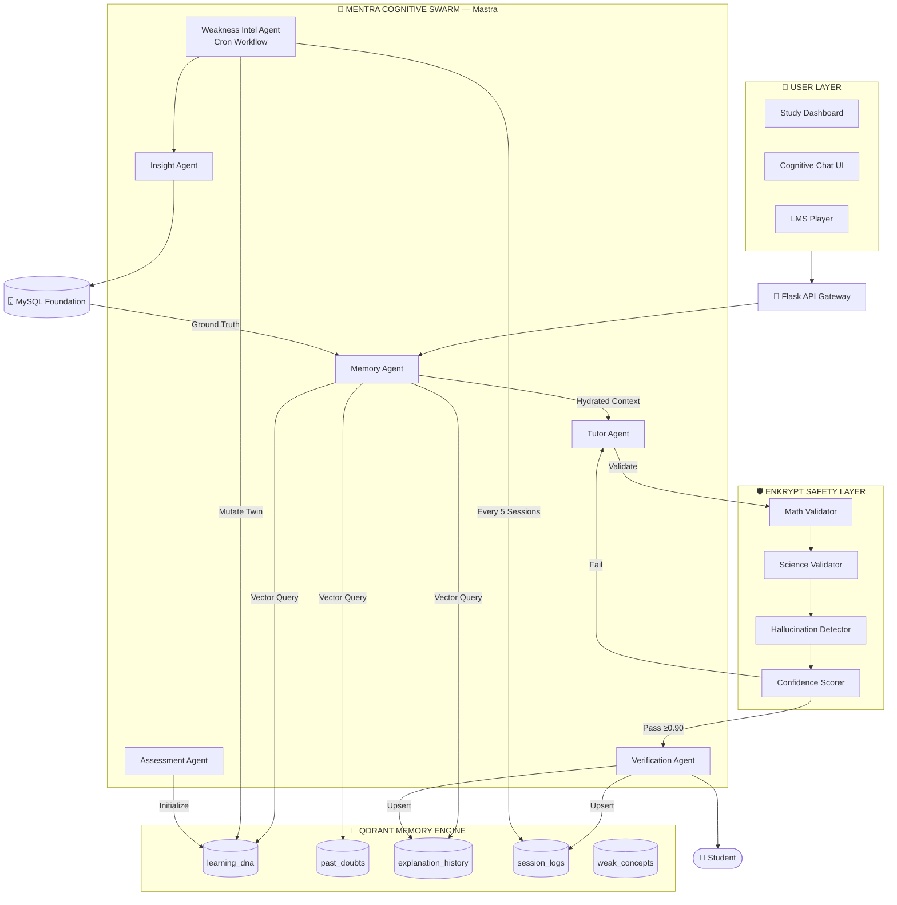

# Mentra X — Architecture Diagram Builder Guide

**Purpose:** Allow creation of a world-class architecture diagram in under 30 minutes.  
**Target:** Top-30 quality visual for hackathon submission.

---

## QUICK START: Recommended Tool

Use **Excalidraw** (excalidraw.com) — free, browser-based, beautiful output. Export as SVG for submission.

---

## 1. Canvas Setup

| Setting | Value |
|---|---|
| Canvas size | 1920 × 1200 px (or Full HD) |
| Background | `#0D0D0D` (near-black) |
| Grid | Off |
| Font | Nunito or Inter (available in Excalidraw) |
| Export | SVG → PNG at 2x resolution |

---

## 2. Color Palette (Copy these exact hex codes)

| Element | Color | Hex |
|---|---|---|
| Layer background - User | Dark grey-blue | `#111827` |
| Layer background - Mastra | Deep purple | `#1E1347` |
| Layer background - Qdrant | Deep teal-blue | `#0C2340` |
| Layer background - Enkrypt | Deep crimson | `#2D0A0A` |
| Layer background - MySQL | Dark slate | `#1A1A2E` |
| Mastra components (fill) | Purple | `#7C3AED` |
| Qdrant components (fill) | Teal | `#0891B2` |
| Enkrypt components (fill) | Red | `#DC2626` |
| MySQL components (fill) | Orange | `#D97706` |
| Text (primary) | White | `#FFFFFF` |
| Text (secondary) | Light grey | `#9CA3AF` |
| Arrow - standard | Grey | `#6B7280` |
| Arrow - memory/vector | Cyan | `#06B6D4` |
| Arrow - safety | Red | `#EF4444` |
| Arrow - twin mutation | Green | `#22C55E` |
| Arrow - Mastra workflow | Purple | `#8B5CF6` |
| Layer border | Subtle | `#374151` |

---

## 3. Layer Layout — Component Positioning

Layout the diagram as **5 horizontal bands stacked vertically**. Each band is a system layer.

```
┌────────────────────────────────────────────────────────────────────────┐
│  BAND 1 (y: 0–120px)       USER LAYER                                 │
├────────────────────────────────────────────────────────────────────────┤
│  BAND 2 (y: 160–240px)     FLASK API GATEWAY                          │
├────────────────────────────────────────────────────────────────────────┤
│  BAND 3 (y: 280–620px)     MENTRA COGNITIVE SWARM — Mastra            │
│                            (Largest band — most content)               │
├────────────────────────────────────────────────────────────────────────┤
│  BAND 4 (y: 660–900px)     QDRANT MEMORY   |   ENKRYPT SAFETY         │
│                            (Side-by-side, equal width)                 │
├────────────────────────────────────────────────────────────────────────┤
│  BAND 5 (y: 940–1040px)    MYSQL RELATIONAL FOUNDATION                │
└────────────────────────────────────────────────────────────────────────┘
```

---

## 4. Band 1: User Layer (Top)

**Height:** 120px  
**Fill:** `#111827`  
**Border radius:** 12px

**Place 3 boxes side-by-side (equal width):**

| Box | Label | Icon |
|---|---|---|
| Left | `Study Dashboard` | 📊 (use emoji or SVG) |
| Center | `Cognitive Chat UI` | 💬 |
| Right | `LMS Video Player` | 🎬 |

- Font size: 14px, color `#FFFFFF`
- Box fill: `#1F2937`, rounded corners

**One arrow out (center-bottom):** `HTTPS / WebSocket` → Band 2  
Arrow color: `#6B7280` (grey)

---

## 5. Band 2: Flask API Gateway

**Height:** 80px  
**Fill:** `#1F2937`

**4 pill/chip shapes inline:**
`[ JWT Auth ]` `[ Rate Limiter ]` `[ Session Manager ]` `[ Route Guard ]`

Chip fill: `#374151`, text: `#9CA3AF`, font: 12px

**Arrow out (center-bottom):** `Structured Request` → Band 3

---

## 6. Band 3: Mentra Cognitive Swarm (Mastra) — MAIN BAND

**Height:** 340px  
**Fill:** `#1E1347`  
**Border:** 2px dashed, `#7C3AED`  
**Label (top-left):** `🧠 MENTRA COGNITIVE SWARM` — font 18px bold, color `#A78BFA`  
**Sub-label (top-right):** `Powered by Mastra AI` — font 11px, color `#7C3AED`

**6 Hexagonal nodes** arranged in 2 rows of 3:

**Row 1 (y: top half of band):**
| Position | Agent | Fill |
|---|---|---|
| Left | `Memory Agent` | `#4C1D95` |
| Center | `Tutor Agent` | `#6D28D9` |
| Right | `Verification Agent` | `#4C1D95` |

**Row 2 (y: bottom half of band):**
| Position | Agent | Fill |
|---|---|---|
| Left | `Assessment Agent` | `#4C1D95` |
| Center | `Weakness Intel Agent` *(dashed border)* | `#4C1D95` |
| Right | `Insight Agent` | `#4C1D95` |

**Internal arrows (purple, `#8B5CF6`):**
- `Memory Agent` → `Tutor Agent` (label: `Hydrated Twin Context`)
- `Tutor Agent` → `Verification Agent` (label: `Validated Output`)
- `Weakness Intel Agent` → `Insight Agent` (label: `Weakness Clusters`)
- `Assessment Agent` → `Memory Agent` (label: `Initialize Twin`)

**Arrows out from Band 3:**
- `Memory Agent` → Band 4 Left (Qdrant): color `#06B6D4`, label `Vector Query`
- `Tutor Agent` → Band 4 Right (Enkrypt): color `#EF4444`, label `Validate Output`
- `Weakness Intel Agent` → Band 4 Left (Qdrant): color `#22C55E`, label `Mutate Twin`
- `Insight Agent` → Band 5 (MySQL): color `#D97706`, label `Push Revision Plan`

---

## 7. Band 4: Memory + Safety (Split Band)

**Height:** 240px  
**Split 50/50 left/right with a gap of 20px**

### Left Half: Qdrant Memory Engine
**Fill:** `#0C2340`  
**Border:** 2px solid `#0891B2`  
**Label:** `🔵 QDRANT MEMORY ENGINE` — color `#22D3EE`

**5 stacked card shapes:**
```
[ learning_dna          ] ← primary twin store
[ past_doubts           ]
[ explanation_history   ]
[ session_logs          ]
[ weak_concepts         ]
```
Card fill: `#164E63`, text: `#67E8F9`, font 12px

**Arrow in:** from Memory Agent (cyan, top)  
**Arrow out:** to Memory Agent (cyan, top — bidirectional)  
**Arrow in:** from Weakness Agent (green, right side)

### Right Half: Enkrypt Safety Layer
**Fill:** `#2D0A0A`  
**Border:** 2px solid `#DC2626`  
**Label:** `🛡️ ENKRYPT SAFETY LAYER` — color `#FCA5A5`

**5 stacked validator cards:**
```
[ Math Accuracy Validator     ]
[ Science Fact Validator      ]
[ Hallucination Detector      ]
[ Pedagogy Evaluator          ]
[ Confidence Scorer 0.0–1.0   ]
```
Card fill: `#450A0A`, text: `#FCA5A5`, font 12px

**Decision diamond at bottom of Enkrypt band:**
`Score ≥ 0.90?`
- YES arrow: color `#22C55E` → Student Output (right)
- NO arrow: color `#EF4444` → back to Tutor Agent (left)

**Arrow in:** from Tutor Agent (red, top)

---

## 8. Band 5: MySQL Foundation (Bottom)

**Height:** 100px  
**Fill:** `#1A1A2E`  
**Border:** 1px solid `#374151`  
**Label:** `🗄️ MENTRA RELATIONAL FOUNDATION` — color `#FCD34D`

**6 pill chips inline:**
`[ Users ]` `[ Courses ]` `[ Quiz Scores ]` `[ XP Ledger ]` `[ Portfolios ]` `[ Skill Graph ]`

Chip fill: `#292929`, text: `#FCD34D`

**Arrow up (center):** `Deterministic Ground Truth` → Band 3 (Mastra)  
Color: `#6B7280`

---

## 9. Student Output Node

Place to the **right of Band 4**, vertically centered:

**Shape:** Circle  
**Label:** `👤 Student`  
**Fill:** `#1F2937`  
**Border:** 2px solid `#22C55E`

**Arrow in:** from Verification Agent (green, `#22C55E`)  
Label: `Final Response + Quiz`

---

## 10. Legend Box (Bottom Right)

Small legend box:
```
Legend:
──────────────────
→  Standard Data Flow
→  Vector / Memory (cyan)
→  Safety Intercept (red)
→  Twin Mutation (green)
→  Mastra Workflow (purple)
```

---

## 11. Title Block (Top Left)

```
MENTRA X
AI-Powered Student Digital Twin & Adaptive Learning Agent
HiDevs × Mastra Hackathon 2026
```
Font: Bold 24px / 14px / 11px, color white/grey

---

## 12. Mermaid Version (For Submission Markdown)


