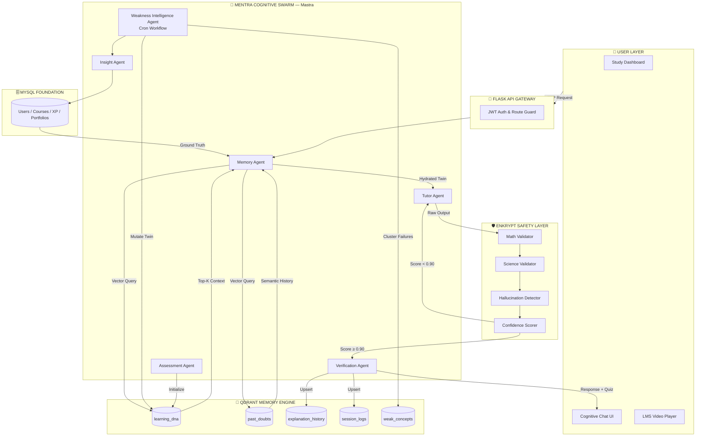

# Mentra X — Architecture Diagram Specification

This specification provides the complete blueprint for recreating the Mentra X architecture in **Draw.io, Excalidraw, Figma, Canva, or Mermaid**. Every layer, component, connection, and data flow label is defined.

---

## 1. Canvas Layout

**Orientation:** Vertical (Top to Bottom)  
**Dimensions:** 2000px × 3000px (or equivalent)  
**Color Palette:**
- Layer backgrounds: `#0F1117` (dark canvas)
- Layer borders: `#1E2128`
- Mastra components: `#7C3AED` (Mastra purple)
- Qdrant components: `#0891B2` (Qdrant teal)
- Enkrypt components: `#DC2626` (Enkrypt red/safety)
- Data flow arrows (standard): `#6B7280` (grey)
- Data flow arrows (memory): `#06B6D4` (cyan)
- Data flow arrows (safety): `#EF4444` (red)
- Data flow arrows (twin mutation): `#22C55E` (green)
- Font: Inter / Roboto

---

## 2. Layer 1 — User Interface Layer (Top)

**Label:** `USER LAYER`  
**Background:** `#111827`  
**Components (Left to Right, 3 boxes):**

| Box Label | Icon | Notes |
|---|---|---|
| `Mentra Study Dashboard` | 📊 dashboard icon | Shows Learning DNA heatmap, mastery % |
| `Cognitive Chat UI` | 💬 chat bubble | WebSocket-connected doubt interface |
| `LMS Video Player` | 🎬 play icon | Existing Mentra course content |

**Arrow out:** One combined `HTTPS REST / WebSocket` arrow pointing DOWN → Layer 2.

---

## 3. Layer 2 — API Gateway Layer

**Label:** `FLASK API GATEWAY`  
**Background:** `#1F2937`  
**Components (inline, horizontal chips):**

`[ JWT Auth ]` — `[ Rate Limiter ]` — `[ Session Manager ]` — `[ Route Guard ]`

**Arrow out:** One `Structured Request` arrow pointing DOWN → Layer 3.

---

## 4. Layer 3 — Mastra Cognitive Swarm (The Brain)

**Label:** `MENTRA COGNITIVE SWARM (Mastra Graph Orchestrator)`  
**Background:** `#1E1347` (deep purple)  
**Border:** `2px solid #7C3AED`  
**Logo:** Official Mastra logo top-right corner.

**Components (Hexagonal nodes, arranged in two rows):**

*Row 1 (Left to Right):*
| Node | Label | Color Fill |
|---|---|---|
| 1 | `Memory Agent` | `#4C1D95` |
| 2 | `Tutor Agent` | `#4C1D95` |
| 3 | `Verification Agent` | `#4C1D95` |

*Row 2 (Left to Right):*
| Node | Label | Color Fill |
|---|---|---|
| 4 | `Assessment Agent` | `#4C1D95` |
| 5 | `Weakness Intelligence Agent (Cron)` | `#6D28D9` |
| 6 | `Insight Agent` | `#4C1D95` |

**Connections inside Layer 3:**
- `Memory Agent` → `Tutor Agent` (labelled: `Hydrated Twin Context`, arrow color: `#06B6D4`)
- `Tutor Agent` → `Verification Agent` (labelled: `Validated Output`, arrow color: `#6B7280`)
- `Verification Agent` → `Output` (labelled: `Final Response + Micro-Quiz`)
- `Assessment Agent` → `Memory Agent` (labelled: `Initialize Twin`)
- `Weakness Intelligence Agent` (dashed border — async cron node)
- `Insight Agent` ← `Weakness Intelligence Agent` (labelled: `Weakness Clusters`)

**Arrows out from Layer 3:**
- `Memory Agent` → Layer 4A (Qdrant): `Vector Query` (cyan arrow)
- `Tutor Agent` → Layer 4B (Enkrypt): `Output for Validation` (red arrow)
- `Weakness Intelligence Agent` → Layer 4A (Qdrant): `Mutate Twin` (green arrow)
- `Insight Agent` → Layer 5 (MySQL): `Push Revision Plan`

---

## 5. Layer 4A — Qdrant Memory Layer

**Label:** `QDRANT COGNITIVE MEMORY ENGINE`  
**Background:** `#0C2340` (dark teal)  
**Border:** `2px solid #0891B2`  
**Logo:** Official Qdrant logo top-right corner.

**Components (Cards, stacked vertically):**

| Card Label | Description |
|---|---|
| `learning_dna` | Full Digital Twin vectors — mastery, style, behavior |
| `past_doubts` | Semantic history of all student questions |
| `explanation_history` | What worked, what failed, by teaching level |
| `session_logs` | Raw session transcripts for cron analysis |
| `weak_concepts` | Clustered failure patterns |

**Arrows in:** Cyan from Memory Agent (`Vector Query`)  
**Arrows out:** Cyan back to Memory Agent (`Top-K Semantic Results`)  
**Arrows in (mutation):** Green from Weakness Intelligence Agent (`Upsert Twin State`)

---

## 6. Layer 4B — Enkrypt Safety Layer

**Label:** `ENKRYPT AI SAFETY LAYER`  
**Background:** `#2D0A0A` (dark red)  
**Border:** `2px solid #DC2626`  
**Logo:** Enkrypt AI logo top-right corner.

**Components (Vertical pipeline cards):**

| Card Label | Trigger |
|---|---|
| `Math Accuracy Validator` | LaTeX/formula detection |
| `Science Fact Validator` | Physics/Chem/Bio tags |
| `Hallucination Detector` | UPSC/History claims |
| `Pedagogy Evaluator` | Every response |
| `Confidence Scorer` | Aggregates 0.0–1.0 score |

**Decision Node:** `Confidence ≥ 0.90?`
- **YES → Arrow OUT** to Student (green)
- **NO → Arrow BACK** to Tutor Agent (red, labelled: `Regenerate`)

---

## 7. Layer 5 — Relational Foundation Layer (Bottom)

**Label:** `MENTRA RELATIONAL FOUNDATION (MySQL)`  
**Background:** `#111827`  

**Components (Horizontal chips):**

`[ Users ]` — `[ Courses ]` — `[ Quiz Scores ]` — `[ XP Ledger ]` — `[ Portfolios ]` — `[ Skill Graph ]`

**Arrow up:** `Deterministic Ground Truth` → Mastra Orchestrator

---

## 8. Mermaid Renderable Diagram

