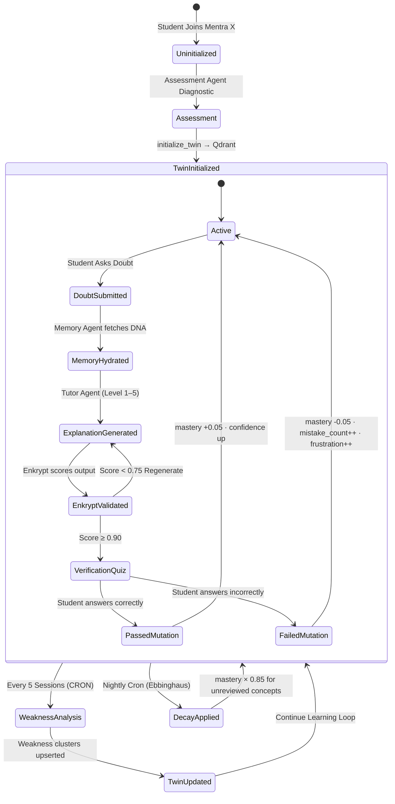
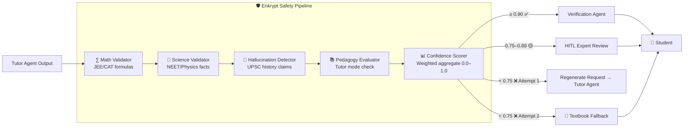

# Mentra X — Architecture Diagram v2 (Mermaid)

**Purpose:** Fully renderable Mermaid diagrams for direct submission.  
**Version:** 2.0 — Post Judge Review Upgrade  
**Render at:** [mermaid.live](https://mermaid.live) or embed in GitHub Markdown.

---

## Diagram 1: Complete System Architecture (Primary Submission Diagram)

```mermaid
graph TD
    %% ─────────────────────────────────────────────────────────────
    %% STYLES
    %% ─────────────────────────────────────────────────────────────
    classDef userBox fill:#1F2937,stroke:#1D4ED8,color:#F9FAFB,rx:8
    classDef gatewayBox fill:#1F2937,stroke:#374151,color:#9CA3AF,rx:8
    classDef orchestrator fill:#4C1D95,stroke:#7C3AED,color:#E9D5FF,rx:12
    classDef agentBox fill:#2D1B69,stroke:#4C1D95,color:#F9FAFB,rx:8
    classDef dnaAgent fill:#2D1B69,stroke:#F59E0B,color:#F9FAFB,rx:8
    classDef cronAgent fill:#2D1B69,stroke:#D97706,color:#FCD34D,rx:8
    classDef qdrantContainer fill:#062030,stroke:#0891B2,color:#22D3EE,rx:12
    classDef qdrantCard fill:#0C3547,stroke:#164E63,color:#67E8F9,rx:6
    classDef enkryptContainer fill:#200808,stroke:#DC2626,color:#FCA5A5,rx:12
    classDef enkryptCard fill:#350808,stroke:#7F1D1D,color:#FCA5A5,rx:6
    classDef safetyPass fill:#1A2A1A,stroke:#22C55E,color:#86EFAC,rx:8
    classDef safetyFail fill:#2A0808,stroke:#EF4444,color:#FCA5A5,rx:8
    classDef hitl fill:#1A3A1A,stroke:#22C55E,color:#86EFAC,rx:8
    classDef dbBox fill:#1F2937,stroke:#D97706,color:#FCD34D,rx:8
    classDef studentOut fill:#1A2A1A,stroke:#22C55E,color:#F9FAFB,rx:50
    classDef teachingBox fill:#1A0F3A,stroke:#7C3AED,color:#A78BFA,rx:8
    classDef fallback fill:#1A0000,stroke:#DC2626,color:#FCA5A5,rx:8

    %% ─────────────────────────────────────────────────────────────
    %% BAND 1: USER LAYER
    %% ─────────────────────────────────────────────────────────────
    subgraph USERS["👤 USER LAYER"]
        DASH["📊 Study Dashboard\nLearning DNA Heatmap · XP · Streak"]
        CHAT["💬 Cognitive Chat UI\nReal-time Doubt Interface"]
        LMS["🎬 LMS Video Player\nContextual Learning"]
    end

    %% ─────────────────────────────────────────────────────────────
    %% BAND 2: FLASK API GATEWAY
    %% ─────────────────────────────────────────────────────────────
    GW["🔐 Flask API Gateway\nJWT Auth · Rate Limiter · Session Manager · Route Guard"]

    %% ─────────────────────────────────────────────────────────────
    %% BAND 3: MASTRA COGNITIVE SWARM
    %% ─────────────────────────────────────────────────────────────
    subgraph SWARM["🧠 MENTRA COGNITIVE SWARM — Powered by Mastra AI"]
        ORCH["◆ Mastra DAG Orchestrator\nGraph-based Multi-Agent Coordinator"]

        AA["① Assessment Agent\nAdaptive diagnostic · JEE/NEET/UPSC calibration\n[Mastra.AI] [Python]"]
        MA["② Memory Agent  🧬 Learning DNA\nParallel Qdrant fetch: Twin + Doubts + Failures + MySQL\n[Mastra.AI] [Python]"]
        TA["③ Tutor Agent  🧬 Learning DNA\nLevel 1–5 adaptive teaching · Calibrated to Twin state\n[Mastra.AI] [Python]"]
        VA["⑤ Verification Agent\nComprehension micro-quiz · Mutates twin on result\n[Mastra.AI] [Python]"]
        WA["⑦ Weakness Intel Agent  ⏰ CRON\nEvery 5 sessions · Semantic failure clustering\n[Mastra.AI] [Python]"]
        IA["Insight Agent\nWeekly progress reports · Revision curriculum\n[Mastra.AI] [Python]"]
    end

    %% ─────────────────────────────────────────────────────────────
    %% ADAPTIVE TEACHING ENGINE CALLOUT
    %% ─────────────────────────────────────────────────────────────
    subgraph TEACH["🎓 Adaptive Teaching Engine"]
        T1["Level 1 — Simple Explanation"]
        T2["Level 2 — Example-Based Teaching"]
        T3["Level 3 — Common Mistakes Analysis"]
        T4["Level 4 — Visual Analogy"]
        T5["Level 5 — Exam Coaching Mode"]
    end

    %% ─────────────────────────────────────────────────────────────
    %% BAND 4A: QDRANT MEMORY ENGINE
    %% ─────────────────────────────────────────────────────────────
    subgraph QDRANT["🔵 QDRANT LEARNING DNA MEMORY ENGINE\nStateful Memory RAG · 1536-dim Cosine · HNSW Index"]
        DNA[("📊 learning_dna\nPrimary Digital Twin · mastery · behavior · DNA")]
        PD[("🔍 past_doubts\nSemantic doubt history · cosine top-K=3")]
        EH[("📝 explanation_history\nTeaching outcomes · what worked · what failed")]
        SL[("📋 session_logs\nRaw transcripts · used by Weakness Agent")]
        WC[("⚠️ weak_concepts\nClustered failures · severity scored")]
    end

    %% ─────────────────────────────────────────────────────────────
    %% BAND 4B: ENKRYPT SAFETY LAYER
    %% ─────────────────────────────────────────────────────────────
    subgraph ENKRYPT["🛡️ ENKRYPT AI SAFETY LAYER\nMandatory Educational Safety Middleware"]
        MV["∑ Math Accuracy Validator\nVerifies JEE calculus · step-by-step logic"]
        SV["🔬 Science Fact Validator\nCross-references NEET Physics/Chemistry claims"]
        HD["🚫 Hallucination Detector\nSemantic match vs NCERT reference corpus"]
        PV["📚 Pedagogy Evaluator\nEnsures tutor mode, not answer-key mode"]
        CS["📊 Confidence Scorer\nconf = 0.35×math + 0.30×sci + 0.20×hallu + 0.15×ped"]
    end

    HITL["👨‍🏫 HITL Expert Review\nTriggered: Score 0.75–0.89"]
    FALLBACK["📖 Verified Textbook Fallback\nTriggered on double failure"]

    %% ─────────────────────────────────────────────────────────────
    %% BAND 5: MYSQL FOUNDATION
    %% ─────────────────────────────────────────────────────────────
    DB[("🗄️ MySQL Relational Foundation\nUsers · Courses · Quiz Scores · XP · Portfolios · Skill Graph")]

    %% ─────────────────────────────────────────────────────────────
    %% STUDENT OUTPUT
    %% ─────────────────────────────────────────────────────────────
    STUDENT(["👤 Student\nPersonalized Learning Response"])

    %% ─────────────────────────────────────────────────────────────
    %% CONNECTIONS — STANDARD FLOW
    %% ─────────────────────────────────────────────────────────────
    USERS -->|"HTTPS / WebSocket"| GW
    GW -->|"Validated Request"| ORCH

    %% ─────────────────────────────────────────────────────────────
    %% CONNECTIONS — MASTRA DAG ORCHESTRATION (purple)
    %% ─────────────────────────────────────────────────────────────
    ORCH -->|"① Onboarding Diagnostic"| AA
    ORCH -->|"② Context Retrieval"| MA
    ORCH -->|"③ Tutor Reasoning"| TA
    ORCH -->|"⑤ Verify Comprehension"| VA
    ORCH -.->|"⑦ CRON: Every 5 Sessions"| WA
    ORCH -->|"Report Trigger"| IA

    %% ─────────────────────────────────────────────────────────────
    %% CONNECTIONS — QDRANT MEMORY FLOWS (cyan)
    %% ─────────────────────────────────────────────────────────────
    MA -->|"fetch_digital_twin"| DNA
    MA -->|"semantic search top-K=3"| PD
    MA -->|"retrieve failed explanations"| EH
    MA -->|"fetch progress"| DB
    MA -->|"③ Hydrated Twin Context"| TA
    AA -->|"initialize_twin"| DNA

    WA -->|"fetch last 5 sessions"| SL

    %% ─────────────────────────────────────────────────────────────
    %% CONNECTIONS — ENKRYPT SAFETY FLOWS (red)
    %% ─────────────────────────────────────────────────────────────
    TA -->|"④ Validate Output"| MV
    MV --> SV --> HD --> PV --> CS
    CS -->|"Score ≥ 0.90 ✓ PASS"| VA
    CS -.->|"⚠️ Score 0.75–0.89 → Expert"| HITL
    CS -->|"Score < 0.75 → Regenerate"| TA
    CS -->|"Double Failure → Fallback"| FALLBACK

    %% ─────────────────────────────────────────────────────────────
    %% CONNECTIONS — TWIN MUTATIONS (green)
    %% ─────────────────────────────────────────────────────────────
    VA -->|"⑥ Final Response + Quiz"| STUDENT
    VA -->|"mutate mastery ±0.05"| DNA
    VA -->|"upsert success_flag"| EH
    VA -->|"append session data"| SL

    WA -->|"upsert failure clusters"| WC
    WA -->|"update weakness_state"| DNA
    WA -->|"Weakness Clusters"| IA
    IA -->|"Push Revision Plan"| DB
    HITL -.->|"Expert-Verified Content"| DNA

    %% ─────────────────────────────────────────────────────────────
    %% CONNECTIONS — MYSQL GROUND TRUTH
    %% ─────────────────────────────────────────────────────────────
    DB -->|"Deterministic Ground Truth"| ORCH

    %% ─────────────────────────────────────────────────────────────
    %% CONNECTIONS — TEACHING ENGINE
    %% ─────────────────────────────────────────────────────────────
    TA -.->|"Selects Level 1–5"| TEACH

    %% ─────────────────────────────────────────────────────────────
    %% APPLY STYLES
    %% ─────────────────────────────────────────────────────────────
    class DASH,CHAT,LMS userBox
    class GW gatewayBox
    class ORCH orchestrator
    class AA,VA,IA agentBox
    class MA,TA dnaAgent
    class WA cronAgent
    class DNA,PD,EH,SL,WC qdrantCard
    class MV,SV,HD,PV enkryptCard
    class CS enkryptContainer
    class HITL hitl
    class FALLBACK fallback
    class DB dbBox
    class STUDENT studentOut
    class T1,T2,T3,T4,T5 teachingBox
```

---

## Diagram 2: Digital Twin Mutation Lifecycle

---

## Diagram 3: Enkrypt Validation Flow

