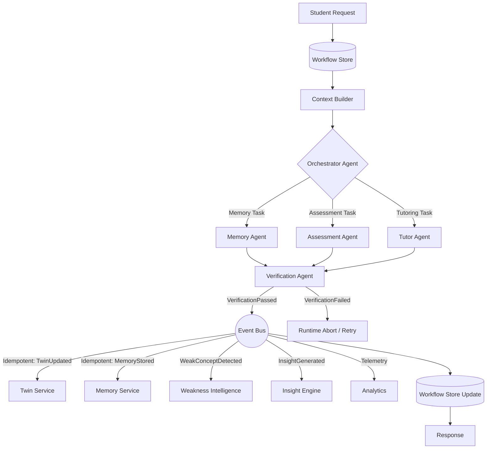

# Phase 4 Workflow & Context Design

## Directed Acyclic Graph (DAG) Execution Flow

When a user initiates an interaction via the AI Tutor Chat UI, the Mastra Cognitive Swarm triggers a deterministic cascade of agent workflows, centrally managed by the **Agent Runtime** and **Workflow State Store**.

## Detailed Stage Transitions

### 1. Ingestion Phase
- **Student Request**: User sends a chat message.
- **Workflow State**: The Runtime initializes a tracking entry in the `Workflow State Store` with a new `workflow_id`, setting status to `started`.
- **Context Builder**: The `ContextBuilder` aggregates `StaticContext`, `DynamicContext`, and `ExecutionContext` into an immutable `UnifiedContext`.

### 2. Orchestration Phase (Routing)
- The Orchestrator LLM receives the `Unified Context`.
- It determines which sub-agent is required, updating the `current_agent` in the `Workflow Store`.

### 3. Execution Phase
- **Tutor Agent**: Executes semantic explanation tools.
- **Assessment Agent**: Executes `start_assessment_session()` tool.
- **Memory Agent**: Executes deep dive `retrieve_semantic_memory()` tools.

### 4. Verification Phase
- The raw output from the execution phase is handed to the **Verification Agent**.
- It ensures the response adheres to safety and pedagogical guardrails.

### 5. Event Bus & Fan-out Phase (Idempotent)
- Agents emit events to the internal Event Bus.
- Every event includes `event_id`, `workflow_id`, `idempotency_key`, `timestamp`, `event_version`, and `source_agent`.
- Downstream services (Twin, Memory, Insights) process these events. The idempotency keys ensure no duplicate mutations occur if a workflow resumes from failure.
- Finally, the response is yielded to the UI and the Workflow Store is marked `completed`.

## Agent State Definitions

- **Shared Context**: Global immutable read-only context (Twin, Qdrant vectors) valid for the duration of the workflow.
- **Workflow Context**: The DAG step state stored in the `Workflow Store`.
- **Execution Context**: Scratchpad specific to a single agent generating a response.
- **Tool Context**: The exact JSON schema payload prepared for a Facade method.
- **Error Context**: If a Facade throws an error, the DAG intercepts it, maps it to an `Error Context`, and feeds it back to the agent for a retry strategy.
