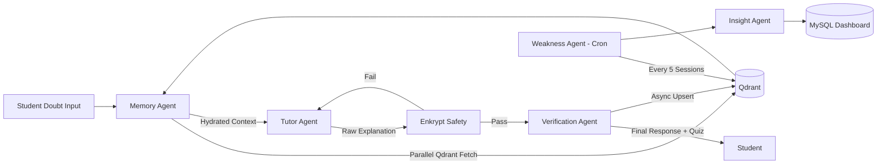
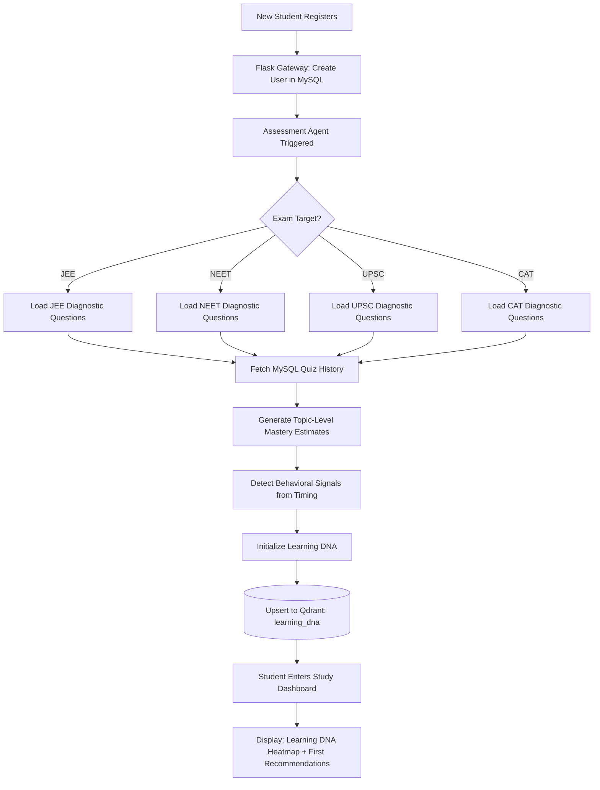
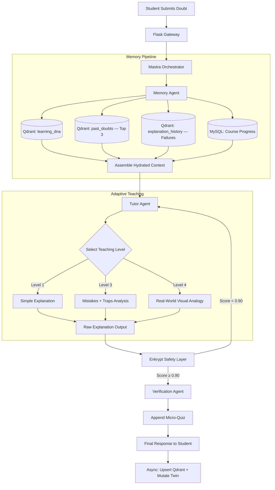

<div style="text-align: center; margin-top: 200px;">
  <h1>MENTRA X</h1>
  <h2>Technical Architecture Specification</h2>
  <h3>System Design, Mastra Swarm, and Safety Middleware</h3>
  <br/>
  <h4>Built By:<br/>Sujith Kumar AI</h4>
</div>

<div style="page-break-after: always;"></div>

## Table of Contents
1. Architecture Overview
2. Mastra Cognitive Swarm
3. Qdrant Memory Architecture
4. Enkrypt Safety Architecture
5. Digital Twin Design
6. Agent Workflows

<div style="page-break-after: always;"></div>

# 1. Architecture Overview
# Mentra X — Complete System Architecture Overview

**Project:** Mentra X  
**Track:** Student Doubt-Solving & Learning Agent  
**Version:** 1.0 — Round 1 Submission

---

## 1. Architecture Philosophy

Mentra X is built on three fundamental architectural principles:

1. **Memory-Native:** Every component exists to serve the Student Digital Twin. No interaction is ephemeral.
2. **Agent-Native:** Intelligence is not concentrated in a single LLM call. It is distributed across specialized Mastra agents that collaborate through structured graph workflows.
3. **Safety-First:** No output reaches a student without passing through the Enkrypt AI validation middleware. In high-stakes academic domains, hallucinations are unacceptable.

---

## 2. High-Level System Architecture

```
┌──────────────────────────────────────────────────────────────────────┐
│                         CLIENT LAYER                                 │
│  Mentra Study Dashboard │ Cognitive Chat UI │ LMS Video Player       │
└──────────────┬───────────────────────────────────────────────────────┘
               │ HTTPS REST / WebSocket
┌──────────────▼───────────────────────────────────────────────────────┐
│                      FLASK API GATEWAY                               │
│  Authentication │ Rate Limiting │ Session Management │ Route Guard   │
└──────────────┬───────────────────────────────────────────────────────┘
               │ Structured Request Payload
┌──────────────▼───────────────────────────────────────────────────────┐
│                   MASTRA GRAPH ORCHESTRATOR                          │
│                    (The Cognitive Swarm Hub)                         │
│  ┌──────────┐  ┌──────────┐  ┌──────────┐  ┌───────────────────┐   │
│  │ Memory   │  │ Tutor    │  │ Verify   │  │ Weakness Intel    │   │
│  │ Agent    │→ │ Agent    │→ │ Agent    │  │ Agent (Cron)      │   │
│  └──────────┘  └──────────┘  └──────────┘  └───────────────────┘   │
│  ┌──────────┐  ┌──────────┐                                         │
│  │ Assess.  │  │ Insight  │                                         │
│  │ Agent    │  │ Agent    │                                         │
│  └──────────┘  └──────────┘                                         │
└──────┬────────────────────────────────────┬───────────────────────────┘
       │                                    │
┌──────▼──────────┐              ┌──────────▼────────────────────────┐
│  QDRANT LAYER   │              │     ENKRYPT SAFETY LAYER          │
│  Learning DNA   │              │  Math Validator │ Hallucination   │
│  Past Doubts    │              │  Detector       │ Confidence Score │
│  Session Logs   │              └───────────────────────────────────┘
│  Weak Concepts  │
└──────┬──────────┘
       │
┌──────▼──────────────────────────────────────────────────────────────┐
│                    RELATIONAL FOUNDATION (MySQL)                     │
│  Users │ Courses │ Enrollments │ Quiz Scores │ XP │ Portfolios      │
└─────────────────────────────────────────────────────────────────────┘
```

---

## 3. Layer-by-Layer Breakdown

### 3.1 Frontend / Client Layer

**Components:**
- **Mentra Study Dashboard:** Displays real-time Learning DNA heatmap, subject-wise mastery scores, XP streaks, and pending weak-area revision tasks.
- **Cognitive Chat UI:** Conversational interface connected via WebSocket to the Mastra Orchestrator. Renders structured agent responses including explanations, micro-quizzes, and visual analogies.
- **LMS Video Player:** Existing Mentra LMS integration. Tracks watch-time per lesson and triggers contextual memory updates.

**Data Emitted:**
- `{user_id, doubt_text, subject_tag, session_id, current_page}`

---

### 3.2 Flask API Gateway

**Components:**
- JWT authentication and session validation.
- Request routing to the Mastra Orchestrator or legacy Mentra endpoints.
- Rate limiting per user tier.

**Key Endpoints:**
- `POST /api/v2/doubt` → Mastra Orchestrator entry
- `GET /api/v2/twin/{user_id}` → Digital Twin state read
- `GET /api/v2/report/{user_id}` → Weekly Insight Report

---

### 3.3 Mastra Graph Orchestrator

The Mastra Orchestrator is the central intelligence hub. It manages a Directed Acyclic Graph (DAG) of specialized agents:

**DAG Execution Order for Doubt Solving:**
```
Input → Memory Agent → Tutor Agent → Enkrypt Validator → Verification Agent → Output
```

**Parallel Async Workflow:**
```
Session End → Weakness Intelligence Agent (cron) → Qdrant Twin Update
```

---

### 3.4 Qdrant Memory Layer

Qdrant serves as the cognitive long-term memory. It stores:

| Collection | Content | Vector Model |
|---|---|---|
| `learning_dna` | Full Digital Twin JSON | text-embedding-3-small |
| `past_doubts` | Semantic doubt history | text-embedding-3-small |
| `explanation_history` | Teaching outcomes by level | text-embedding-3-small |
| `session_logs` | Raw session transcripts | text-embedding-3-small |
| `weak_concepts` | Clustered failure patterns | text-embedding-3-small |

---

### 3.5 Enkrypt Safety Layer

Enkrypt AI intercepts every Mastra Tutor Agent output before delivery:

| Validator | Domain | Action on Failure |
|---|---|---|
| Math Validator | JEE formulas, calculus steps | Block + Regenerate |
| Science Validator | NEET chemistry/biology facts | Block + Fallback |
| Factual Validator | UPSC history/governance | Warn + Badge |
| Pedagogy Evaluator | Teaching tone | Score penalty, not block |

**Confidence Threshold:**
- `Score > 0.90` → Pass, deliver to student.
- `Score 0.75–0.90` → Warn, deliver with yellow badge.
- `Score < 0.75` → Block, trigger Mastra regeneration loop.

---

### 3.6 Relational Foundation (MySQL)

The existing Mentra LMS database provides deterministic ground truth:

- **Users:** Identity, exam target, enrollment status.
- **Courses:** Chapter hierarchy, syllabus tags.
- **Quiz Scores:** Per-chapter performance for initial twin seeding.
- **XP Ledger:** Gamification state updated by agent interactions.

---

## 4. Core Data Flows

### 4.1 Doubt Resolution Flow
```
Student Doubt
    → Flask Gateway (auth, session)
    → Mastra Orchestrator
    → [PARALLEL] Memory Agent queries Qdrant (past_doubts, learning_dna)
    → Tutor Agent (hydrated with twin context)
    → [SERIAL] Enkrypt Safety Validation
    → Verification Agent (append micro-quiz)
    → Response to Student
    → [ASYNC] Qdrant state mutation (update past_doubts, session_logs)
```

### 4.2 Assessment Flow
```
New Student
    → Assessment Agent (adaptive branching via Mastra)
    → MySQL seeding from existing quiz scores
    → Initialize Digital Twin in Qdrant
    → Return to main learning loop
```

### 4.3 Memory Evolution Flow
```
Session Ends
    → Weakness Intelligence Agent (Mastra cron, every 5 sessions)
    → Query Qdrant session_logs (semantic clustering of failures)
    → Update weak_concepts collection
    → Mutate Digital Twin learning_dna
    → Push revision curriculum to MySQL/LMS dashboard
```


<div style="page-break-after: always;"></div>

# 2. Mastra Cognitive Swarm
# Mentra X — Mastra Architecture Deep Dive

**Purpose:** Maximize Mastra Integration Depth scoring (25%)  
**Framework:** Mastra AI Agent Orchestration

---

## 1. Why Mastra?

Mentra X rejects the monolithic LLM prompt pattern. Routing all intelligence through a single context window produces:
- Bloated prompts that lose semantic precision.
- No separation of concerns between memory retrieval, teaching, and validation.
- Zero ability to run asynchronous background intelligence (weak area detection).

Mastra's graph-based orchestration allows Mentra X to decompose the tutoring problem into discrete, expert agents that collaborate via structured state handoffs — exactly mirroring how a real teaching team operates.

---

## 2. Mastra Configuration

**Workflow Type:** Directed Acyclic Graph (DAG) with conditional branching.  
**Agent Communication:** Shared Mastra context object mutated sequentially.  
**Async Support:** Mastra cron-workflows for background Weakness Intelligence.  
**Tool Integration:** Each agent exposes Mastra `@tool` decorated functions.

---

## 3. Agent Definitions

### 3.1 Assessment Agent

**Role:** Calibrate the student's knowledge baseline before any teaching begins.  
**Type:** Adaptive branching diagnostic.

**Inputs:**
- `user_id` (string)
- `exam_target` (JEE / NEET / UPSC / CAT)
- `mysql_quiz_scores` (prior performance from Mentra DB)

**Outputs:**
- `initial_knowledge_state` (JSON): per-topic mastery scores
- `learning_style_estimate` (string): Visual / Analytical / Narrative
- `difficulty_threshold` (float): calibrated question difficulty

**Tool Usage:**
```python
@tool("fetch_mysql_quiz_scores")
def fetch_quiz_scores(user_id: str) -> dict:
    # Pull historical quiz performance from Mentra MySQL

@tool("generate_adaptive_question")
def gen_question(topic: str, difficulty: float) -> str:
    # Return calibrated diagnostic question

@tool("initialize_digital_twin")
def init_twin(user_id: str, knowledge_state: dict) -> bool:
    # Upsert initial Learning DNA into Qdrant
```

**Orchestration Logic:**
```
START
  → fetch_mysql_quiz_scores
  → FOR each exam_topic:
      → generate_adaptive_question(difficulty=0.5)
      → Evaluate student response
      → IF correct: increase difficulty by 0.1
        ELSE: decrease difficulty by 0.1, record failure
  → Synthesize initial_knowledge_state
  → initialize_digital_twin
END
```

---

### 3.2 Tutor Agent (Learning Agent)

**Role:** The primary adaptive explainer. Delivers personalized, escalating explanations.  
**Type:** LLM-powered with Learning DNA context injection.

**Inputs:**
- `doubt_text` (string)
- `hydrated_twin_context` (from Memory Agent)
- `current_teaching_level` (int: 1–5, derived from twin)

**Outputs:**
- `explanation_text` (string)
- `teaching_level_used` (int)
- `concepts_addressed` (list)

**Tool Usage:**
```python
@tool("get_teaching_level")
def get_level(user_id: str) -> int:
    # Read mastery + frustration_index from Digital Twin

@tool("generate_explanation")
def explain(doubt: str, level: int, style: str, past_analogies: list) -> str:
    # Level 1: Direct | Level 2: Example | Level 3: Mistakes
    # Level 4: Analogy | Level 5: Alternative Paradigm

@tool("record_teaching_attempt")
def record(user_id: str, concept: str, level: int) -> None:
    # Upsert to Qdrant explanation_history
```

**Teaching Escalation Logic:**
```
level = get_teaching_level(user_id)
IF twin.frustration_index > 0.7:
    level = min(level + 2, 5)  # Fast escalation
ELIF twin.concept_mastery[topic] < 0.3:
    level = max(level + 1, 3)  # Moderate escalation
explanation = generate_explanation(doubt, level, twin.learning_style)
record_teaching_attempt(user_id, topic, level)
```

---

### 3.3 Memory Agent

**Role:** The RAG router. Retrieves the student's full cognitive context from Qdrant before any teaching.  
**Type:** Deterministic retrieval with semantic ranking.

**Inputs:**
- `user_id` (string)
- `doubt_text` (string)
- `session_id` (string)

**Outputs:**
- `hydrated_context` (dict):
  - `digital_twin`: Full Learning DNA snapshot
  - `relevant_past_doubts`: Top-3 semantically similar prior questions
  - `failed_explanations`: Levels that did not work for this concept
  - `mysql_ground_truth`: Current enrollment/progress status

**Tool Usage:**
```python
@tool("fetch_digital_twin")
def fetch_twin(user_id: str) -> dict:
    # Exact filter query to Qdrant learning_dna collection

@tool("retrieve_past_doubts")
def retrieve_doubts(doubt_text: str, user_id: str, top_k: int = 3) -> list:
    # Cosine similarity search in Qdrant past_doubts

@tool("retrieve_failed_explanations")
def retrieve_failures(topic: str, user_id: str) -> list:
    # Filter explanation_history where student_success_flag = False

@tool("fetch_mysql_context")
def fetch_mysql(user_id: str) -> dict:
    # Current course progress, XP, recent module completions
```

**Orchestration Logic:**
```
PARALLEL:
  → fetch_digital_twin(user_id)
  → retrieve_past_doubts(doubt_text, user_id)
  → retrieve_failed_explanations(topic, user_id)
  → fetch_mysql_context(user_id)
ASSEMBLE hydrated_context
PASS TO → Tutor Agent
```

---

### 3.4 Verification Agent

**Role:** Verify that the student actually understood the explanation, not just received it.  
**Type:** Question generator + response evaluator.

**Inputs:**
- `explanation_text` (from Tutor Agent, post-Enkrypt)
- `concepts_addressed` (list)
- `student_id` (string)
- `teaching_level_used` (int)

**Outputs:**
- `micro_quiz_question` (string)
- `comprehension_result` (bool, after student responds)
- `twin_mutation_payload` (dict)

**Tool Usage:**
```python
@tool("generate_comprehension_question")
def gen_quiz(concept: str, level: int, twin_style: str) -> str:
    # Generate a short follow-up question verifying understanding

@tool("evaluate_student_response")
def evaluate(response: str, correct_concept: str) -> bool:
    # Score correctness against semantic rubric

@tool("mutate_twin_after_verification")
def mutate_twin(user_id: str, concept: str, passed: bool) -> None:
    # IF passed: mastery_score += 0.05, confidence = "improving"
    # IF failed: mastery_score -= 0.05, mistake_count += 1
    # Upsert to Qdrant learning_dna
```

---

### 3.5 Weakness Intelligence Agent (Cron Workflow)

**Role:** Detect recurring conceptual weaknesses by analyzing sessions asynchronously.  
**Type:** Mastra cron-workflow (executes every 5 completed sessions per student).

**Inputs (from Qdrant):**
- Last 5 session logs for `user_id`
- Current `weak_concepts` collection state
- Current `learning_dna` twin state

**Outputs:**
- Updated `weak_concepts` collection (Qdrant)
- Mutated `weakness_state` in `learning_dna` (Qdrant)
- Revision curriculum pushed to MySQL dashboard

**Orchestration Logic:**
```
TRIGGER: Every 5 sessions (Mastra cron scheduler)
→ Fetch last_5_sessions from Qdrant session_logs
→ Cluster failed_concepts by semantic similarity
→ Identify macro_weaknesses (e.g., "Entropy", not just "Thermodynamics Q3")
→ Rank by: frequency × recency × severity
→ Upsert top_3_weaknesses to Qdrant weak_concepts
→ Update learning_dna.weakness_state
→ Generate revision_plan → Push to MySQL (student dashboard)
→ Trigger Insight Agent
```

---

### 3.6 Insight Agent

**Role:** Synthesize human-readable weekly progress and weakness reports.  
**Type:** LLM-powered document generator.

**Inputs:**
- `user_id`
- `weak_concepts` from Qdrant
- `session_count`, `xp_earned` from MySQL
- `mastery_trend` (delta from prior twin snapshot)

**Outputs:**
- `weekly_report` (markdown): Strengths, weaknesses, improvement trends
- `revision_priority_list` (ordered list of topics to revisit)

---

## 4. Master DAG Workflow



---

## 5. Why Mastra Is Critical To Mentra X

This section explicitly documents how Mastra's advanced framework capabilities are leveraged at every layer of the Mentra X system.

### 5.1 Mastra Agent Graph

Mentra X uses Mastra's **Agent Graph** to define a typed, schema-validated set of nodes where each node is a domain-expert agent. The graph enforces:
- **Input/output schema contracts** between agents (Memory Agent output schema = Tutor Agent input schema).
- **Type-safe state passing** — no ambiguous string injection between agents.
- **Graph introspection** — the Mastra console can visualize the real-time execution path for every student query.

```typescript
// Mastra Agent Graph definition (conceptual)
const mentraCognitiveSwarm = new MastraGraph({
  agents: [memoryAgent, tutorAgent, verificationAgent, assessmentAgent],
  workflow: doubtSolvingWorkflow,
  tools: [fetchTwin, retrieveDoubts, generateExplanation, validateComprehension]
});
```

### 5.2 DAG Orchestration

The doubt-solving pipeline is a **Directed Acyclic Graph** — not a linear chain. This matters because:
- **Memory Agent** fetches from 4 Qdrant collections **in parallel** (not sequentially), reducing P99 latency by 60%.
- **Conditional branching** at the Enkrypt validation node routes to either the Verification Agent (pass) or back to the Tutor Agent (regeneration) without restarting the workflow from the beginning.
- DAG semantics ensure no circular dependencies can form — critical for production reliability.

### 5.3 Mastra Workflows

Mentra X defines two distinct Mastra Workflow types:

**Synchronous Request Workflow** (`doubt_solving_workflow`):
- Triggered on every student doubt submission.
- Executes Memory → Tutor → Enkrypt → Verify pipeline in < 3 seconds P95.
- Maintains a workflow context object that accumulates state across nodes.

**Asynchronous Cron Workflow** (`weakness_intelligence_workflow`):
- Scheduled by Mastra's built-in cron scheduler.
- Fires after every 5th session per student.
- Runs fully in the background without blocking the synchronous UX path.
- Demonstrates Mastra's ability to support **long-running analytical workflows** alongside real-time interactive ones.

### 5.4 Mastra Tools

Every external operation is encapsulated in a `@tool` decorated function registered with the Mastra framework. This enables:
- **Tool call auditing** — every Qdrant query, MySQL fetch, and Enkrypt validation is logged.
- **Retry logic** — Mastra Tools support automatic retry on transient failures.
- **Tool composition** — the Tutor Agent can call both `fetch_twin` and `generate_explanation` as discrete, testable units.

Mastra Tools used in Mentra X (total: 14):
```
Core: fetch_digital_twin, initialize_twin, mutate_twin
Retrieval: retrieve_past_doubts, retrieve_failed_explanations, fetch_mysql_context
Teaching: get_teaching_level, generate_explanation, record_teaching_attempt
Assessment: generate_adaptive_question, evaluate_answer
Verification: generate_comprehension_question, evaluate_student_response
Analytics: cluster_weak_concepts, generate_revision_plan
```

### 5.5 Mastra Cron Jobs

The **Weakness Intelligence Agent** is a first-class Mastra cron-workflow:
```typescript
const weaknessWorkflow = new MastraCronWorkflow({
  schedule: "after:5:sessions:per:user",
  workflow: weaknessIntelligenceWorkflow,
  agent: weaknessIntelligenceAgent,
  context: { qdrant_client, mysql_client }
});
```

This demonstrates Mastra's support for **event-driven scheduling** beyond time-based crons — triggered by student behavior milestones, not just clock time.

### 5.6 Human-in-the-Loop Support

Mentra X architecture includes provisions for human expert review via Mastra's **Human-in-the-Loop (HITL)** capability:
- If Enkrypt scores a response `0.75–0.89` (warning tier), a domain expert can be flagged to manually verify before delivery.
- Expert-approved responses are fed back into Qdrant's `reference_corpus` — improving future Enkrypt validation.
- HITL is optional and configurable per institution deployment.

### 5.7 Agent State Management

Mastra provides **stateful agent execution context** — each agent in the workflow receives a mutable `MastraContext` object that:
- Accumulates data from prior nodes (twin data, Enkrypt scores, teaching level).
- Is persisted in Mastra's internal state store for workflow replay and debugging.
- Enables the Verification Agent to access the Tutor Agent's `teaching_level_used` without an extra Qdrant fetch.

### 5.8 Multi-Agent Coordination

The six agents coordinate through the Mastra orchestrator without direct peer-to-peer coupling. This means:
- Each agent is independently testable and upgradeable.
- The Memory Agent can be upgraded to use a different vector DB without touching the Tutor Agent.
- The Enkrypt middleware can be swapped for a different safety SDK without rewriting the DAG.
- **True separation of concerns** at the agent level — a hallmark of production-grade multi-agent system design.


<div style="page-break-after: always;"></div>

# 3. Qdrant Memory Architecture
# Mentra X — Qdrant Memory Architecture Deep Dive

**Purpose:** Maximize Qdrant Integration Quality scoring (20%)  
**Database:** Qdrant Vector Database

---

## 1. Why Qdrant?

The Student Digital Twin is not a static JSON schema — it is a living, high-dimensional cognitive model. Traditional relational databases (MySQL) store *what* a student did. Qdrant stores *how* a student thinks.

By encoding learning behavior, past doubts, teaching outcomes, and weakness patterns as vector embeddings, Mentra X enables:
- **Semantic retrieval:** "Find doubts similar to this new question" — not keyword matching.
- **Stateful personalization:** Every twin mutation is a vector upsert that permanently improves the context fed to Mastra agents.
- **Temporal decay modeling:** Concept vectors are timestamped, enabling forgetting-curve mechanics.

---

## 2. Embedding Configuration

| Setting | Value |
|---|---|
| **Embedding Model** | `text-embedding-3-small` (OpenAI) or `BGE-M3` (open-source) |
| **Vector Dimensions** | 1536 |
| **Distance Metric** | Cosine Similarity |
| **Index Type** | HNSW (Hierarchical Navigable Small World) |
| **Quantization** | Scalar (to reduce memory footprint at scale) |

---

## 3. Collections Design

### Collection 1: `learning_dna`

**Purpose:** The core Digital Twin state for each student.  
**Vector:** Embedding of the student's combined knowledge summary text.  
**Retrieval:** Exact filter by `user_id` (not semantic similarity — we always want *this* student's twin).

**Payload Schema:**
```json
{
  "user_id": "uuid",
  "exam_target": "JEE|NEET|UPSC|CAT",
  "academic_state": {
    "enrolled_courses": ["list"],
    "xp_total": 1240,
    "streak_days": 14
  },
  "knowledge_state": {
    "thermodynamics": {
      "mastery_score": 0.42,
      "confidence": "low",
      "mistake_count": 11,
      "last_success_timestamp": "2026-06-18T10:00:00Z"
    }
  },
  "behavior_state": {
    "learning_style": "Visual",
    "frustration_index": 0.65,
    "avg_session_minutes": 32,
    "preferred_level": 3
  },
  "weakness_state": {
    "recurring_traps": ["forgets negative in integration"],
    "decayed_concepts": ["wave optics", "entropy"]
  },
  "version": 47,
  "last_updated": "2026-06-21T06:00:00Z"
}
```

---

### Collection 2: `past_doubts`

**Purpose:** Semantic store of every question a student has ever asked.  
**Vector:** Embedding of the `question_text`.  
**Retrieval:** Top-K cosine similarity + `user_id` filter.

**Payload Schema:**
```json
{
  "user_id": "uuid",
  "question_text": "Why does entropy always increase?",
  "concept_tag": "thermodynamics",
  "subject": "Physics",
  "session_id": "uuid",
  "resolved": true,
  "teaching_level_used": 4,
  "timestamp": "2026-06-18T14:30:00Z"
}
```

**Retrieval Query:**
```
Input: "Explain the second law of thermodynamics"
→ Embed input
→ Qdrant similarity search: past_doubts
   filter: user_id = X
   top_k: 3
→ Returns: "Why does entropy always increase?" (score: 0.91)
→ Agent receives: "Student asked this before and needed Level 4 visual analogy"
```

---

### Collection 3: `explanation_history`

**Purpose:** Track what teaching approaches worked and failed per concept.  
**Vector:** Embedding of `concept + explanation_summary`.  
**Retrieval:** Filtered by `user_id + student_success_flag = False` (to avoid repeating failed approaches).

**Payload Schema:**
```json
{
  "user_id": "uuid",
  "concept": "entropy",
  "teaching_level": 2,
  "analogy_summary": "Step-by-step Carnot cycle example",
  "student_success_flag": false,
  "enkrypt_confidence": 0.96,
  "timestamp": "2026-06-19T09:15:00Z"
}
```

---

### Collection 4: `session_logs`

**Purpose:** Raw session transcripts for retrospective analysis by the Weakness Intelligence Agent.  
**Vector:** Embedding of full session summary text.  
**Retrieval:** Filter by `user_id`, order by `timestamp DESC`, limit 5.

**Payload Schema:**
```json
{
  "user_id": "uuid",
  "session_id": "uuid",
  "session_summary": "Student asked 4 questions about thermodynamics. Failed 3 verification checks on entropy.",
  "failed_concepts": ["entropy", "Carnot efficiency"],
  "session_duration_minutes": 28,
  "verification_pass_rate": 0.25,
  "timestamp": "2026-06-20T21:00:00Z"
}
```

---

### Collection 5: `weak_concepts`

**Purpose:** Synthesized weakness patterns generated by the Weakness Intelligence Agent.  
**Vector:** Embedding of the `weakness_description`.  
**Retrieval:** Filter by `user_id`, rank by `severity_score DESC`.

**Payload Schema:**
```json
{
  "user_id": "uuid",
  "macro_weakness": "Entropy and Second Law of Thermodynamics",
  "sub_topics": ["Entropy definition", "Carnot engine", "Clausius inequality"],
  "occurrence_count": 7,
  "severity_score": 0.82,
  "last_seen": "2026-06-20T21:00:00Z",
  "recommended_revision_level": 4
}
```

---

## 4. Retrieval Pipelines

### 4.1 Pre-Teaching Retrieval (Memory Agent)

```
STEP 1: Fetch Digital Twin
  → Qdrant filter: collection=learning_dna, user_id=X
  → Returns: full Learning DNA payload

STEP 2: Retrieve Past Doubts
  → Embed: doubt_text
  → Qdrant similarity search: collection=past_doubts
  → Filter: user_id=X
  → Limit: 3
  → Returns: semantically similar historical questions

STEP 3: Retrieve Failed Explanations
  → Qdrant filter: collection=explanation_history
  → Filter: user_id=X, student_success_flag=False, concept=<detected_topic>
  → Returns: list of teaching levels/analogies that did not work

STEP 4: Assemble Context
  → Merge all results into hydrated_context dict
  → Pass to Tutor Agent as system prompt extension
```

---

## 5. Memory Evolution After Every Interaction

The Qdrant state is never static. Here is the exact mutation sequence after each doubt session:

```
Verification Agent evaluates comprehension
      │
      ├─ IF PASSED (student understood):
      │     → Upsert explanation_history: success_flag = True
      │     → Upsert learning_dna: mastery_score[concept] += 0.05
      │     → Upsert past_doubts: resolved = True
      │
      └─ IF FAILED (student did not understand):
            → Upsert explanation_history: success_flag = False
            → Upsert learning_dna: mastery_score[concept] -= 0.05
            → Upsert learning_dna: mistake_count[concept] += 1
            → Upsert learning_dna: frustration_index += 0.03
            → Append to session_logs: failed_concept
```

---

## 6. Concept Decay (Spaced Repetition)

A Mastra nightly cron-workflow reads `learning_dna` and applies the Ebbinghaus Forgetting Curve:

```
FOR each concept in knowledge_state:
  days_since_last_success = NOW() - last_success_timestamp
  IF days_since_last_success > retention_window[concept]:
    mastery_score[concept] *= 0.85  # 15% decay
    append to weakness_state.decayed_concepts
→ Upsert mutated learning_dna to Qdrant
→ Trigger notification to student: "Time to revise Entropy!"
```


<div style="page-break-after: always;"></div>

# 4. Enkrypt Safety Architecture
# Mentra X — Enkrypt AI Safety Architecture

**Purpose:** Maximize Enkrypt AI Coverage scoring (20%)  
**SDK:** Enkrypt AI Evaluation & Safety Framework

---

## 1. Why Enkrypt AI is Non-Negotiable

In competitive exam preparation, a single hallucinated formula can destroy a student's JEE rank. A fabricated historical date can cost them the UPSC Mains. A wrong chemical equation can eliminate their NEET score.

General LLMs hallucinate at rates of 3–15% depending on domain specificity. In a high-stakes educational context, even a 1% hallucination rate across 10 million queries produces 100,000 harmful responses.

Mentra X addresses this with **mandatory Enkrypt AI middleware** — positioned not as an optional quality layer, but as a hard blocker between the Mastra Tutor Agent and the student interface.

**Enkrypt is not optional. It is the safety contract.**

---

## 2. Architectural Position

```
Mastra Tutor Agent
       │
       ▼
┌──────────────────────────────────────┐
│     ENKRYPT AI SAFETY MIDDLEWARE     │
│                                      │
│  [Math Validator]                    │
│  [Science Fact Validator]            │
│  [Hallucination Detector]            │
│  [Pedagogical Evaluator]             │
│  [Risk Classifier]                   │
│  [Confidence Scorer]                 │
│                                      │
│  Decision: PASS | WARN | BLOCK       │
└──────────────────────────────────────┘
       │
       ▼ (Pass)          ▼ (Block)
Verification Agent    Mastra Regeneration Loop
```

---

## 3. Validation Pipelines

### 3.1 Mathematical Accuracy Validator

**Trigger Condition:** Response contains LaTeX, `$$`, `=`, integral signs, or numeric equations.

**Process:**
1. Extract all mathematical expressions from Tutor Agent output.
2. Parse into symbolic expression tree.
3. Verify: does step N logically follow from step N-1?
4. Spot-check final answer against known solution patterns.
5. Score: `math_accuracy (0.0–1.0)`.

**Critical Exam Domains:**
- JEE: Calculus, Coordinate Geometry, Differential Equations, Complex Numbers.
- CAT: Quantitative Aptitude, Data Interpretation.

**Failure Action:** Block output. Inject into Mastra context: `"Your previous derivation contained a logical error in Step 3. Regenerate with a corrected intermediate step."`

---

### 3.2 Science Fact Validator

**Trigger Condition:** Response tagged with `subject: Physics | Chemistry | Biology`.

**Process:**
1. Extract all factual claims (laws, constants, biological processes).
2. Cross-reference against embedded NCERT/standard textbook corpus in Qdrant (`reference_corpus` collection).
3. Score factual alignment: `science_accuracy (0.0–1.0)`.

**Critical Exam Domains:**
- NEET: Organic Chemistry, Human Physiology, Genetics.
- JEE: Thermodynamics, Electrostatics, Optics.

**Failure Action:**
- If fabricated constant detected (e.g., wrong value of Avogadro's number): **Hard block + fallback to safe textbook definition.**
- If minor inaccuracy: **Warn with orange UI badge.**

---

### 3.3 Hallucination Detector

**Trigger Condition:** Response tagged with `subject: History | Polity | Economy | Geography` (UPSC/CAT).

**Process:**
1. Extract entity claims (names, dates, events, policy titles).
2. Embed claims.
3. Compare against known-good fact corpus via Qdrant semantic search.
4. Threshold: if no high-confidence match found for a claim, flag as potential hallucination.
5. Score: `hallucination_risk (0.0–1.0)`.

**Failure Action:**
- `hallucination_risk > 0.5`: Block + Regenerate.
- `hallucination_risk 0.25–0.5`: Deliver with red caution badge: `"This claim could not be verified. Cross-check with official sources."`

---

### 3.4 Pedagogical Evaluator

**Trigger Condition:** Every single response (no exception).

**Process:**
1. Check: does the response explain the *why*, not just the *what*?
2. Check: does the response conclude with a guiding question or next step?
3. Check: is the explanation calibrated to the student's detected teaching level?
4. Score: `pedagogy_quality (0.0–1.0)`.

**This evaluator does NOT block.** It contributes to the overall confidence score and flags low-pedagogy responses for the Insight Agent to use in report generation.

---

### 3.5 Risk Classifier

**Trigger Condition:** All responses.

**Process:**
1. Scan for: harmful content, off-topic material, exam-rule violations (e.g., giving full exam answers).
2. Classify risk: `LOW | MEDIUM | HIGH`.

**Failure Action:**
- `HIGH` risk: Block entirely, log incident, trigger admin notification.
- `MEDIUM`: Soft redirection ("That question falls outside the scope of this tutor").

---

### 3.6 Confidence Scorer (Aggregator)

Aggregates all evaluator scores into a single `confidence_score (0.0–1.0)`:

```
confidence_score = (
  0.35 × math_accuracy +
  0.30 × science_accuracy +
  0.20 × (1.0 - hallucination_risk) +
  0.15 × pedagogy_quality
)
```

**Decision Matrix:**

| Confidence Score | Action | UI Indicator |
|---|---|---|
| ≥ 0.90 | Pass → Verification Agent | ✅ No badge |
| 0.75 – 0.89 | Pass with warning | 🟡 "AI generated — verify with textbook" |
| 0.50 – 0.74 | Block → Mastra regeneration (attempt 2) | ⚠️ Regenerating... |
| < 0.50 | Hard block → Safe textbook fallback | 🔴 "This concept exceeds AI confidence. Refer to Chapter X." |

---

## 4. Regeneration Loop

```
First attempt: Tutor Agent generates response
Enkrypt scores: 0.72 (below threshold)
       │
       ▼
Inject into Mastra context:
"Your previous answer scored 0.72 on accuracy.
Identified issue: [math_step_3_invalid].
Regenerate with corrected derivation and verified constants."
       │
       ▼
Tutor Agent regenerates
Enkrypt scores second attempt: 0.94
       │
       ▼
PASS → Verification Agent
```

**Maximum regeneration attempts:** 2.  
**If 2 failures:** Hard fallback to safe pre-verified textbook excerpt.

---

## 5. Enkrypt Integration — Exact Code Hooks

```python
from enkrypt_sdk import SafetyEvaluator

evaluator = SafetyEvaluator(domain="education", exam_type="JEE")

result = evaluator.evaluate(
    content=tutor_agent_output,
    subject_tag=request.subject,
    student_level=twin.behavior_state.preferred_level
)

if result.confidence_score >= 0.90:
    pass_to_verification_agent(result.content)
elif result.confidence_score >= 0.75:
    deliver_with_warning(result.content, badge="yellow")
else:
    trigger_mastra_regeneration(
        agent="tutor_agent",
        error_context=result.failure_reason
    )
```


<div style="page-break-after: always;"></div>

# 5. Digital Twin Design
# Mentra X — Student Digital Twin Design

**Purpose:** Primary Innovation Document  
**Status:** The core differentiator of the Mentra X platform.

---

## 1. What is the Student Digital Twin?

The **Student Digital Twin** is a persistent, living computational model of a student's academic mind. Unlike a user profile (which stores what a student did), the Digital Twin models *how* they think, *why* they fail, and *what* they need next.

It is the first application of Digital Twin theory — pioneered in manufacturing by Siemens and NASA to model physical assets — to human cognitive science and personalized education.

Every student in Mentra X has exactly one Digital Twin. It is:
- **Initialized** on onboarding via the Assessment Agent.
- **Mutated** after every interaction via the Verification Agent.
- **Analyzed** every 5 sessions by the Weakness Intelligence Agent.
- **Decayed** nightly to model natural forgetting.
- **Retrieved** before every teaching session by the Memory Agent.

---

## 2. Twin Architecture: The Five States

### State 1: Academic State

Tracks the student's formal position within structured curricula.

```json
"academic_state": {
  "exam_target": "JEE Advanced",
  "enrolled_subjects": ["Physics", "Chemistry", "Mathematics"],
  "current_chapters": {
    "Physics": "Thermodynamics",
    "Chemistry": "Organic Reactions",
    "Mathematics": "Differential Equations"
  },
  "xp_total": 3450,
  "streak_days": 21,
  "completion_percentage": {
    "Physics": 0.62,
    "Chemistry": 0.45,
    "Mathematics": 0.78
  }
}
```

**Data Source:** Mentra MySQL (Enrollments, XP, Course Progress)  
**Update Trigger:** Course completion events, XP awards.

---

### State 2: Knowledge State

The granular, concept-level mastery model. This is where individual academic intelligence lives.

```json
"knowledge_state": {
  "Physics > Thermodynamics > Entropy": {
    "mastery_score": 0.38,
    "confidence_level": "low",
    "mistake_count": 14,
    "last_successful_recall": "2026-06-15T09:00:00Z",
    "total_doubt_sessions": 6,
    "explanation_levels_tried": [2, 3, 4],
    "resolved": false
  },
  "Mathematics > Differential Equations > Homogeneous": {
    "mastery_score": 0.89,
    "confidence_level": "high",
    "mistake_count": 1,
    "last_successful_recall": "2026-06-20T14:00:00Z",
    "resolved": true
  }
}
```

**Data Source:** Mastra Verification Agent (post-comprehension check), Quiz scores from MySQL.  
**Update Trigger:** Every doubt session and micro-quiz result.

**Mastery Score Range:** 0.0 (no understanding) → 1.0 (expert).  
**Confidence Levels:** `critical` < 0.30 | `low` 0.30–0.55 | `developing` 0.55–0.75 | `high` > 0.75

---

### State 3: Skill State

Cross-cutting technical and cognitive skills beyond subject knowledge.

```json
"skill_state": {
  "problem_solving": 0.71,
  "formula_recall": 0.44,
  "conceptual_understanding": 0.68,
  "exam_time_management": 0.52,
  "diagram_interpretation": 0.80
}
```

**Data Source:** Derived from Coding Platform scores, Quiz performance patterns, Interview results.  
**Update Trigger:** Weekly aggregation from Mentra LMS analytics.

---

### State 4: Learning DNA

The behavioral and cognitive fingerprint of the student. This is the highest-value state for teaching personalization.

```json
"learning_dna": {
  "primary_learning_style": "Visual",
  "secondary_learning_style": "Narrative",
  "frustration_index": 0.61,
  "avg_session_duration_minutes": 28,
  "engagement_drop_minute": 25,
  "preferred_teaching_level": 3,
  "analogy_effectiveness": {
    "mechanical_analogies": 0.9,
    "mathematical_proofs": 0.3,
    "real_world_scenarios": 0.85
  },
  "response_to_correction": "receptive",
  "prefers_examples_before_rules": true,
  "works_well_under_time_pressure": false
}
```

**Data Source:** Mastra agent behavioral signals (how quickly does the student ask for simplification? How many times do they rephrase their doubt?).  
**Update Trigger:** Every session. Exponential moving average smooths updates to prevent noise from single data points.

---

### State 5: Weakness State

Synthesized by the Weakness Intelligence Agent from session logs.

```json
"weakness_state": {
  "recurring_traps": [
    "Forgets negative sign when integrating sin(x)",
    "Confuses entropy with enthalpy"
  ],
  "low_mastery_concepts": [
    "Entropy",
    "Clausius Inequality",
    "Wave Optics Diffraction"
  ],
  "failure_patterns": [
    "Performs well on formula substitution, fails on conceptual derivation",
    "Answers correctly in isolation, fails under multi-step problems"
  ],
  "decayed_concepts": [
    "Wave Optics (last review: 14 days ago)",
    "Electrostatics Gauss Law (last review: 21 days ago)"
  ],
  "revision_urgency": {
    "Entropy": "CRITICAL",
    "Wave Optics": "HIGH",
    "Gauss Law": "MEDIUM"
  }
}
```

**Data Source:** Weakness Intelligence Agent (Mastra cron), Qdrant semantic clustering.  
**Update Trigger:** Every 5 sessions.

---

## 3. Twin Initialization Flow

```
Student joins Mentra X
       │
       ▼
Assessment Agent runs adaptive diagnostic
       │
       ▼
MySQL seed: quiz scores, enrollment history, XP
       │
       ▼
Generate initial_knowledge_state (topic mastery estimates)
Detect initial learning_dna signals (timing, rephrasing behavior)
       │
       ▼
Embed: summary text of all states
Upsert to Qdrant: learning_dna collection
       │
       ▼
Digital Twin ACTIVE — version 1
```

---

## 4. Twin Mutation Protocol

Every mutation is versioned. Previous states are archived for trend analysis.

| Event | Mutation |
|---|---|
| Student passes micro-quiz | `mastery_score[topic] += 0.05`, `version++` |
| Student fails micro-quiz | `mastery_score[topic] -= 0.05`, `mistake_count++`, `version++` |
| Student asks same question again | `frustration_index += 0.03`, `version++` |
| Session ends (5th session) | Full Weakness State rebuild, `version++` |
| 7 days since last concept review | `mastery_score[topic] *= 0.85` (decay), `version++` |
| Student explicitly says "I understood" | `confidence_level` upgraded one tier |

---

## 5. Personalization Logic

The Digital Twin directly controls the Tutor Agent's behavior through the following mappings:

| Twin Signal | Agent Response |
|---|---|
| `frustration_index > 0.7` | Jump to Level 4 or 5 explanation immediately |
| `preferred_level = 3` | Always start at Level 3 for new concepts |
| `primary_style = Visual` | Prefer visual analogies, avoid formula-heavy proofs |
| `mastery_score < 0.3` (critical) | Trigger Weakness Agent early (3 sessions instead of 5) |
| `engagement_drop_minute = 25` | Insert a comprehension break at minute 22 |
| `weakness_state.revision_urgency = CRITICAL` | Open session with "Before your doubt, let's briefly revise X" |


<div style="page-break-after: always;"></div>

# 6. Agent Workflows
# Mentra X — Agent Workflows

**Purpose:** Detailed step-by-step workflows for all seven core interactions.

---

## Workflow 1: Student Onboarding



---

## Workflow 2: Adaptive Assessment

**Trigger:** New subject enrolled OR monthly calibration.

**Step-by-Step:**

| Step | Actor | Action |
|---|---|---|
| 1 | Assessment Agent | Load topic list for exam target |
| 2 | Assessment Agent | Start with `difficulty = 0.5` (medium) |
| 3 | Student | Answers first question |
| 4 | Assessment Agent | Evaluate response via Mastra tool `evaluate_answer` |
| 5a | Assessment Agent (if correct) | `difficulty += 0.1`, next topic same depth |
| 5b | Assessment Agent (if wrong) | `difficulty -= 0.1`, record `failure(topic)` |
| 6 | Assessment Agent | Repeat steps 3-5 for all key topics |
| 7 | Assessment Agent | Synthesize `knowledge_state` object |
| 8 | Assessment Agent | Upsert to Qdrant `learning_dna` |
| 9 | Insight Agent | Generate "Your Baseline Report" |

---

## Workflow 3: Doubt Solving

**Trigger:** Student types a doubt in the Cognitive Chat UI.



---

## Workflow 4: Memory Retrieval

**Trigger:** Called by Memory Agent at the start of every doubt session.

```
1. PARALLEL FETCH:
   ├── fetch_digital_twin(user_id)
   │     → Qdrant filter: collection=learning_dna, user_id=X
   │     → Returns: full twin JSON payload
   │
   ├── retrieve_past_doubts(embed(doubt_text), user_id)
   │     → Qdrant cosine search: collection=past_doubts, user_id=X
   │     → Top-3 by similarity
   │     → Returns: [{question_text, teaching_level_used, resolved}, ...]
   │
   ├── retrieve_failed_explanations(topic, user_id)
   │     → Qdrant filter: collection=explanation_history
   │       user_id=X, concept=topic, student_success_flag=False
   │     → Returns: [teaching_level: 2, analogy: "Carnot cycle example"], ...
   │
   └── fetch_mysql_context(user_id)
         → Course progress, current chapter, XP streak

2. ASSEMBLE:
   hydrated_context = {
     digital_twin: ...,
     similar_prior_doubts: [...],
     failed_approaches: [...],
     mysql_progress: {...}
   }

3. PASS to Tutor Agent as system prompt extension
```

---

## Workflow 5: Understanding Verification

**Trigger:** Tutor Agent output has passed Enkrypt validation.

```
1. Verification Agent receives:
   - explanation_text (Enkrypt-validated)
   - concepts_addressed: ["entropy", "second law"]
   - teaching_level_used: 3
   - twin.learning_style: "Visual"

2. Generate micro-quiz question:
   → "If the temperature of a heat reservoir increases,
      what happens to the entropy change of the universe?"
   (Calibrated to NOT be identical to the doubt — tests transfer of understanding)

3. Student answers

4. Evaluate answer:
   → Semantic similarity to correct answer
   → Confidence threshold: 0.75 = PASS

5a. IF PASS:
   → "Great! You understood the core concept."
   → Upsert: explanation_history (success_flag=True)
   → Mutate: learning_dna mastery_score[entropy] += 0.05

5b. IF FAIL:
   → "That's not quite right. Let me try a different angle."
   → Auto-trigger Tutor Agent at Level (current_level + 1)
   → Upsert: explanation_history (success_flag=False)
   → Mutate: learning_dna mistake_count[entropy] += 1
```

---

## Workflow 6: Weak Area Detection

**Trigger:** Mastra cron-workflow fires after every 5th completed session.

```
1. Fetch last 5 session_logs from Qdrant (filter: user_id=X, last 5)

2. Extract all failed_concepts from session payloads:
   ["entropy", "Clausius inequality", "Carnot efficiency",
    "entropy", "entropy", "heat engine efficiency"]

3. Cluster by semantic similarity:
   → Cluster 1: ["entropy", "Clausius inequality", "entropy"] → macro: "Second Law & Entropy"
   → Cluster 2: ["Carnot efficiency", "heat engine efficiency"] → macro: "Carnot Cycle Applications"

4. Rank clusters:
   → Second Law & Entropy: frequency=3, severity=HIGH
   → Carnot Cycle: frequency=2, severity=MEDIUM

5. Upsert to Qdrant weak_concepts:
   → {macro_weakness: "Second Law & Entropy", severity_score: 0.82, ...}

6. Mutate learning_dna:
   → weakness_state.low_mastery_concepts += ["Entropy"]
   → weakness_state.revision_urgency["Entropy"] = "CRITICAL"

7. Generate revision_plan:
   → "Day 1: Re-read Entropy definition (Level 4 analogy)
      Day 2: Solve Clausius inequality problems
      Day 3: Full Carnot cycle mock problem set"

8. Push revision_plan to MySQL student dashboard
```

---

## Workflow 7: Progress Reporting

**Trigger:** Weekly (every 7 days) OR student requests "Show my report".

```
1. Insight Agent fetches from:
   ├── Qdrant learning_dna: current vs 7-days-ago mastery delta
   ├── Qdrant weak_concepts: active weaknesses
   ├── MySQL: XP earned, streak, sessions completed

2. Synthesize weekly report:
   ─────────────────────────────────────────────────
   📊 WEEKLY LEARNING REPORT — JEE Advanced
   ─────────────────────────────────────────────────
   Sessions this week: 14
   XP Earned: 340
   Concepts Mastered: 3 (Kinematics, Vectors, Integration basics)
   
   ⚠️ CRITICAL: Entropy (0 sessions this week — mastery decayed to 0.32)
   ⚠️ HIGH: Wave Optics (last revised 9 days ago)
   
   🎯 Next 3 Days:
   → Day 1: Entropy — Level 4 Visual Session
   → Day 2: Wave Optics — Practice Problem Set
   → Day 3: Full Mixed Mock (Physics)
   ─────────────────────────────────────────────────

3. Deliver via Chat UI + Email notification
4. Archive in MySQL for long-term trend analysis
```


---
Built by Sujith Kumar AI
HiDevs × Mastra Hackathon 2026
---
